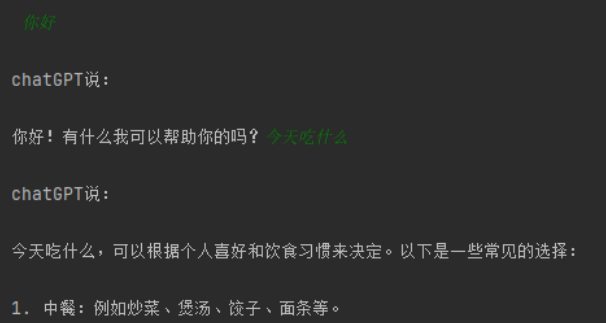
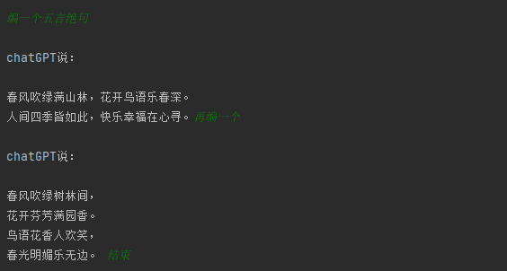
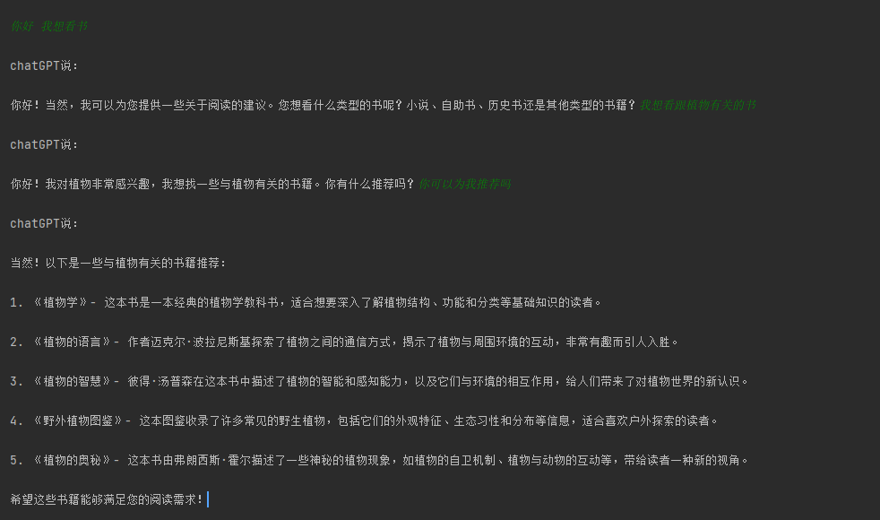

# chatGPT-video 开箱即用 解锁ChatGPT识别文字、音频、视频能力

[](https://blog.csdn.net/m0_56877576?spm=1000.2115.3001.5343)
[](src/main/resources/static/image/1694071820309.png)


**ChatGPT是由[OpenAI](https://openai.com/)训练的一款大型语言模型，能够和你进行任何领域的对话。**
**这款程序主要让chatGPT拥有处理音频和视频的能力**
****
<div align=center>
 
  <p>chatGPT来处理您的视频(该图片由chatGPT绘制)</p>
</div>


- [📖 项目简介](#-项目简介)
- [🏢 软件架构](#-软件架构)
- [🛠 特性](#-特性)
    - [🔢不同功能的聊天接口](#提供了多个完整的chatGPT聊天方式API)
        - [1.OneMessageChatwithGPT单条信息交换功能](#1OneMessageChatwithGPT为单条信息交换功能)
        - [2.ShortChatWithGPT流式信息交互](#2ShortChatWithGPT为流式信息交互)
        - [3.MediumChatWithGPT单向聊天记录流式信息交互](#3MediumChatWithGPT为单向聊天记录流式信息交互)
        - [4.LongChatWithGPT为双向聊天记录流式信息交互](#4LongChatWithGPT为双向聊天记录流式信息交互)
- [🚀 快速开始](#-快速开始)
- [💬 交流](#如果有什么需要改进联系我，欢迎交流改进)
- [🙏 鸣谢](#鸣谢)

# 📖 项目简介

我能用这个程序干什么？
- [💬提供了多个完整的chatGPT聊天方式API。](#提供了多个完整的chatGPT聊天方式API)
- [🎬提供了视频网站的视频解析功能。](#视频网站的视频解析)
- [⚡文件下载功能。](#文件下载功能)
- [🎵视频转音频功能。](#视频转为音频)
- [🔤音频转文字功能。](#-音频转文字功能)
- [📜一站式的配置文件。](#修改配置文件)

# 🏢 软件架构
- jdk8
- SpringBoot
- 讯飞API
- ChatGPT-Java-API 
- hutool
- okhttp3

#### JDK 8 下载地址

你可以从以下链接下载并安装 JDK 8：

- [Oracle JDK 8 Downloads](https://www.oracle.com/java/technologies/javase/javase-jdk8-downloads.html): 访问 Oracle 官方网站以获取 JDK 8 的下载链接。

# 🛠 特性
## 提供了多个完整的chatGPT聊天方式API

提供了四个不同功能的聊天测试用例

### 1.OneMessageChatwithGPT为单条信息交换功能

该接口适合一些简单的一问一答制功能
<br>
<br>

### 2.ShortChatWithGPT为流式信息交互

该接口适合进行一些简单的不需要聊天记录的对话功能，适合进行长时间的一问一答制功能



### 3.MediumChatWithGPT为单向聊天记录流式信息交互
该接口适合进行一些富有逻辑的单向问题


### 4.LongChatWithGPT为双向聊天记录流式信息交互
该接口适合进行复杂的大型逻辑处理，在每次聊天的时候都会带上chatGPT和自己的完整聊天记录，随着聊天的增加，会消耗大量的token。你可能需要修改这段代码提示chatGPT
```
Message GPTMessage = Message.of("我会在每次聊天中添加我们的聊天历史 以下chatGPT回复的聊天历史内容:"+lastMessageValue);
```





# 🚀 快速开始
## 📜修改配置文件
```
//文件位于：com.example.gptvideohelper.common.ConfigParameter
    //需要配置的内容
    String GPT_API_KEY="";//chatGPT的API密钥
    String KEY_SECRET="";//讯飞API接口
    String GPT_API_KEY="";//chatGPT的API密钥
**********************************************************************
    //如果需要走代理    
    int PROXY_PORT=7880;//代理走的端口号 列如7080 要改成自己的
    String PROXY_IP ="";//代理的IP地址 列如127.0.0.1
```
## 🔌直接开始
```
1.将视频移动到src/main/resources/video中
2.打开test文件,修改成自己专属的test文件
2.使用getAudio()获取到音频文件
3.使用getText()获取文本文件
4.使用ToContent解析返回的json
5.配置调用适合自己的GptAPI聊天接口
```
# 如果你需要进行一些自定义修改
## 🎵视频转为音频
```
代码位于VideoHelper中
使用getAudio()功能
里面可以配置编码器、格式等功能 列如：
// 创建一个音频属性对象，指定音频的编码器、比特率、采样率和声道数
        AudioAttributes audioAttr = new AudioAttributes();
        audioAttr.setCodec("pcm_s16le");//无损音频编码 同时也是讯飞要求的格式 想要音频文件变小一点可以在这里改
        audioAttr.setBitRate(128000);
        audioAttr.setSamplingRate(44100);
        audioAttr.setChannels(2);

        // 创建一个编码属性对象，指定音频属性和空的视频属性
        EncodingAttributes encodingAttr = new EncodingAttributes();
        encodingAttr.setFormat("wav");
        encodingAttr.setAudioAttributes(audioAttr);
        encodingAttr.setVideoAttributes(null);
```
## 🔤 音频转文字功能

- 在这个部分，我们主要使用了讯飞开放平台的音频转文字 API。
已经编写了一个示例，名为 `IfasrDemo`，它包含了文件上传、解析 JSON 等功能。你只需要配置好自己的 AppID 和 Key 即可开始使用。

- 如果想自定义其他配置 详细的配置参数可以参考[这里](https://www.xfyun.cn/doc/asr/ifasr_new/API.html)。
一旦提取出文字，你可以使用 `ToContent()` 函数来获取主要内容。
- 最后，我建议将提取出来的文字传递给 ChatGPT 进行文本修正，然后再将修正后的文本发送给 ChatGPT。

<br><br>


## ⚡文件下载功能
```
//以视频文件为例 将这里的请求头和Url设置对即可 或者还有更多包括Se开头的安全信息头（依据下载需要的文件头而定）
            HttpResponse response = HttpRequest.get(videoUrl)
                    .header("Accept", "改成你的Accept值")
                    .header("Accept-Encoding", "改成你的请求头编码方式")
                    .header("Accept-Language", "改成你的语言偏好的值")//语言偏好
                    .header("Origin", "改成你的视频链接地址")
                    .header("Range", "bytes=0-1048575")//请求数据范围 改成你要的值
                    .header("Referer", "改成你的视频链接地址")
                    .header("User-Agent", "改成你的用户标识")
                    .header("Upgrade-Insecure-Requests", "1")
                    .header("Range", "bytes=" + fileSize + "-") // 设置Range头部，从已下载的字节后开始下载
                    .execute();
                    
```
## 🎬视频网站的视频解析
```
/*先通过Api文件夹下的GetHeader获取到需要的文件头信息
一般网站都是会做加密等手段，你需要依据你获取到的Header去获取到真实的视频地址
然后将获取到的信息头添加到getRealUrl方法中
这里的data2要依据具体下载的视频地址进行修改
一般都会存在于json内置的某一数据内有着真实的数据地址
*/
        String realUrl="";
        String url = "你需要获取视频的真实地址的API接口" + parameter1 + "参数2：" +parameter2;
        OkHttpClient client = new OkHttpClient();
        Request request = new Request.Builder().url(url).build();
        Response response = client.newCall(request).execute();
        String responseBody = response.body().string();
        JSONObject json = new JSONObject(responseBody);
        JSONObject data = json.getJSONObject("data");
        //修改：获取data2数组
        JSONArray data2 = data.getJSONArray("data2");//获取嵌套在data json内的其他属性数据
        //修改：遍历data2数组
        for (int i = 0; i < data2.size(); i++) {
            //修改：获取durl数组中的每个元素
            JSONObject durlItem = data2.getJSONObject(i);
            //修改：获取每个元素中的url字段
            realUrl = durlItem.getStr("url");
            System.out.println(realUrl);
        }
        return realUrl;
```
## 💭如果你想修改chatGPT的配置等内容
<br><br>

- 配置方式参考[PlexPt-chatGPT-Java]( https://github.com/PlexPt/chatgpt-java)。

- chatGPTAPI的详细参考[这里](https://platform.openai.com/docs/introduction)(需要一定的英语阅读能力)
##
# 🙏鸣谢
- OpenAi：https://openai.com/
- [PlexPt]()的[chatGPT-JAVA](https://github.com/PlexPt/chatgpt-java) 的开源SDK。

# ☕ 如果有什么需要改进联系我，欢迎交流改进。[](src/main/resources/static/image/1694071820309.png)
欢迎进行技术以及代码交流 包括后续的更新
<div align=center>
 
</div>
